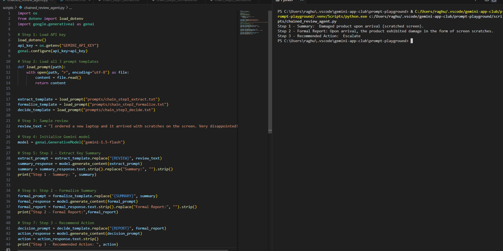

# Prompt Engineering Playground with Gemini

This project explores how different types of prompts affect the quality of LLM responses using Google Gemini.

We used Gemini 1.5 Flash to generate and evaluate outputs from:
- Direct Prompts
- Role-Based Prompts
- Chain-of-Thought (CoT) Prompts
- LangChain PromptTemplate-based Sentiment Classification
- Multi-Step Prompt Chaining Agent

Each output was optionally scored by:
- Gemini itself (self-evaluation)
- Manual scoring logic (1 = correct, 0 = incorrect)

---

## Project Goals

- Compare multiple prompt styles using real-world examples.
- Automate evaluation scoring with LLMs.
- Build a reusable playground for testing prompt engineering ideas.
- Test prompt templates with LangChain and analyze response accuracy.
- Chain LLM prompts together for multi-stage reasoning tasks.

---

## Project Structure

prompt-playground/
├── .venv/ ← Python virtual environment
├── .gitignore
├── README.md
├── requirements.txt
│
├── notebooks/
│ └── prompt_playground.ipynb
│
├── prompts/
│ ├── cot.txt
│ ├── direct.txt
│ ├── few_shot.txt
│ ├── role_based.txt
│ ├── scorer.txt
│ ├── sentiment_template.txt
│ ├── chain_step1_extract.txt
│ ├── chain_step2_formalize.txt
│ └── chain_step3_decide.txt
│
├── results/
│ └── sentiment_scores.csv
│
├── scripts/
│ ├── generate_and_score.py
│ ├── generate_from_template.py
│ └── chained_review_agent.py
│
├── screenshots/
│ ├── prompt_outputs.png
│ └── scoring.png
│
└── .env ← API keys (not pushed to GitHub)


---

## 🆕 Module: Sentiment Classification with LangChain + Gemini

This script demonstrates how to:
- Use `LangChain.PromptTemplate` to fill a structured prompt
- Send the review to Gemini Flash (1.5)
- Get predicted sentiment (Positive/Negative)
- Compare it to expected label
- Score accuracy (1 = correct, 0 = incorrect)
- Save all outputs to `sentiment_scores.csv`

### Example Output

```text
--- Review 1 ---
Input: The movie was fantastic and had great acting.
Sentiment: Positive
Expected: Positive
Score: 1

 Total Score: 3/3
 Accuracy: 100.00%
```
| Review                                             | Expected | Predicted | Score |
| -------------------------------------------------- | -------- | --------- | ----- |
| The movie was fantastic and had great acting.      | Positive | Positive  | 1     |
| It was boring and I almost fell asleep.            | Negative | Negative  | 1     |
| The visuals were good, but the plot made no sense. | Negative | Negative  | 1     |

▶️ How to Run
 "python scripts/generate_from_template.py"

---

## New Module: Chained Gemini Agent (3-Step Reasoning)

This module simulates a real AI assistant that reads a customer review and:

1. Summarizes the core issue
2. Rewrites the summary in a formal tone
3. Recommends one action: ["Flag", "Escalate", "Thank", "Ignore"]

---

### Prompt Chain

| Step | Prompt Template               | Role              |
|------|-------------------------------|-------------------|
| 1️⃣   | chain_step1_extract.txt       | Extract Sentiment |
| 2️⃣   | chain_step2_formalize.txt     | Formal Rewrite    |
| 3️⃣   | chain_step3_decide.txt        | Recommend Action  |

---

### Sample Output

```text
Step 1 - Summary: Damaged product upon arrival (scratched screen).
Step 2 - Formal Report: Upon arrival, the product exhibited damage in the form of screen scratches.
Step 3 - Recommended Action: Escalate
```
---

## 📸 Screenshots

### Prompt Outputs (Multi-Prompt Evaluation)


### Evaluation Score Table


### Chained Agent Output

